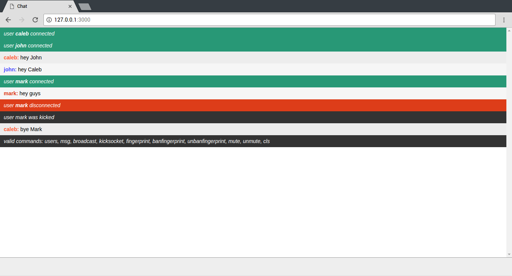

#Simple Socket.IO Webchat

##Screenshot

##Features
* Real-time chat application
* View chat and broadcasts from server console
* Coloured names
* Commands:
	* /help
	* /helpadmin
	* /users
	* /msg
	* /broadcast
	* /ban
	* /unban
	* /mute
	* /unmute
	* /kicksocket
	* /fingerprint
	* /banfingerprint
	* /unbanfingerprint

##How to use
1. Install Node.js along with the following modules:
	* express
	* socket.io
2. Run the server with node.js:
	`node /path/to/index.js`

##Todo
- [ ] Implement /whois to view aliases
- [ ] Implement /fingerprint to fetch fingerprint
- [ ] Implement /reply to reply to direct messages
- [ ] Implement accounts/admin status
- [ ] Implement /stopserver to stop the server
- [ ] Make ban messages bold